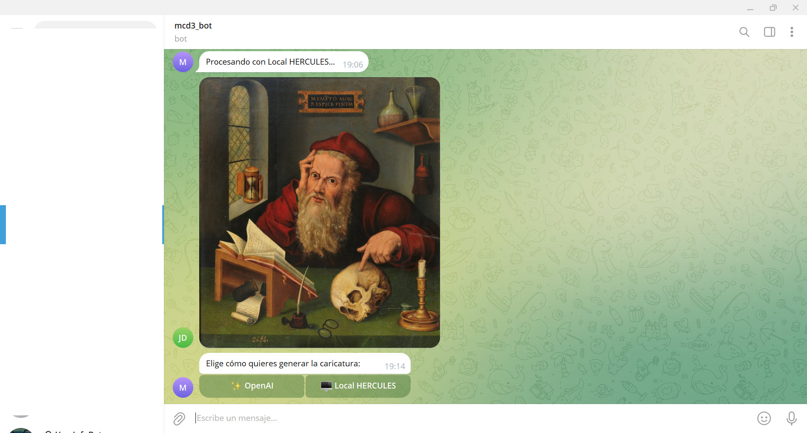
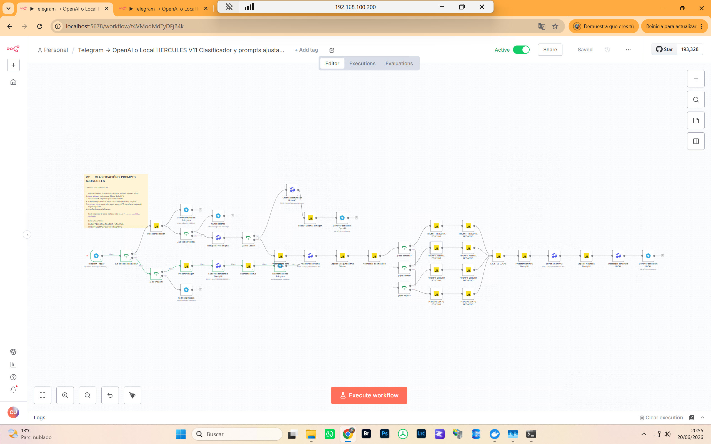

# Telegram → Caricatura IA → Telegram


Workflow de **n8n** que recibe una fotografía desde un bot de Telegram y permite elegir entre dos motores de generación:

- **OpenAI**, como referencia de calidad inmediata.
- **Local HERCULES**, utilizando Ollama y ComfyUI en infraestructura propia.

El resultado se devuelve automáticamente al mismo chat de Telegram.

La versión 2 convierte el proyecto inicial en un sistema híbrido, configurable y preparado para evolucionar hacia una generación completamente local.

---

## Versión actual

La versión recomendada es:

```text
workflow/Telegram_HERCULES_V11_GitHub_SIN_CREDENCIALES_ACTUALIZADO.json
```

Esta versión incorpora selector de motor, clasificación automática del contenido, prompts específicos por tipo de sujeto y generación local mediante HERCULES.

---

## Demostración de la versión 2

| Selector en Telegram | Workflow V2 en n8n |
|---|---|
|  |  |

---

## Qué hace la versión 2

```text
Telegram
   │
   ▼
Recibe una fotografía
   │
   ▼
Botones inline dentro de Telegram
   ├── OpenAI
   └── Local HERCULES
```

### Rama OpenAI

```text
Fotografía
   │
   ▼
OpenAI Images Edits API
   │
   ▼
Conversión Base64 a PNG
   │
   ▼
Envío del resultado a Telegram
```

### Rama Local HERCULES

```text
Fotografía
   │
   ▼
Ollama clasifica el contenido
   ├── Persona
   ├── Animal
   ├── Objeto
   └── Mixto
   │
   ▼
Prompt positivo y negativo específico
   │
   ▼
ComfyUI
   │
   ▼
Qwen Image Edit 2511
   │
   ▼
Lightning LoRA de 4 pasos
   │
   ▼
Resultado en Telegram
```

---

## Novedades principales de la versión 2

### 1. Selector OpenAI o Local HERCULES

El usuario elige directamente desde Telegram mediante botones inline:

```text
✨ OpenAI
🖥️ Local HERCULES
```

Los botones funcionan mediante `callback_query`, sin abrir el navegador ni páginas externas.

### 2. Clasificación automática con Ollama

Antes de generar localmente, Ollama analiza únicamente el tipo principal de contenido:

```json
{"tipo_sujeto":"persona"}
```

Valores posibles:

- `persona`
- `animal`
- `objeto`
- `mixto`

Ollama no redacta el prompt completo. Su función es seleccionar la rama correcta.

### 3. Prompts independientes por categoría

La versión 2 incorpora prompts positivos y negativos separados para:

- personas;
- animales;
- objetos, vehículos y elementos técnicos;
- escenas mixtas.

Esto evita errores como:

- animales convertidos en personas;
- objetos con ojos o caras;
- trajes vacíos interpretados como personas;
- escenas mixtas tratadas como un único sujeto humano.

### 4. Prompt específico para personas

La rama de personas busca:

- mantener reconocibilidad;
- exagerar ojos, sonrisa, mejillas y proporciones;
- conservar pose, ropa, orientación y accesorios;
- producir una caricatura clara, no un retrato realista.

### 5. Prompt específico para animales

La rama animal:

- conserva anatomía natural;
- evita cuerpo humano, brazos, manos o ropa;
- concentra la exageración en cabeza, ojos, orejas, hocico y mejillas;
- mantiene especie, pelaje, marcas, postura y cola.

### 6. Prompt específico para objetos

La rama de objetos:

- conserva identidad y componentes reales;
- exagera forma, escala, proporción y perspectiva;
- evita añadir caras, ojos, boca o anatomía humana;
- funciona especialmente bien con vehículos, aviones, máquinas y piezas museográficas.

### 7. Prompt específico para escenas mixtas

La rama mixta aplica reglas diferentes dentro de una misma imagen:

- personas: exageración facial;
- animales: anatomía animal natural;
- objetos: exageración estructural sin antropomorfismo.

El objetivo es mantener una escena coherente, no una suma de dibujos separados.

### 8. Generación local con ComfyUI

La rama local utiliza:

```text
Qwen Image Edit 2511
Qwen 2.5 VL
Qwen Image VAE
Lightning LoRA 4 steps
```

Configuración actual:

| Parámetro | Valor |
|---|---:|
| Steps | `4` |
| CFG | `1.0` |
| Denoise | `1.0` |
| Model shift | `3.1` |
| LoRA strength | `1.0` |
| Sampler | `euler` |
| Scheduler | `simple` |

### 9. Mejora de velocidad

Sin Lightning LoRA, las pruebas podían tardar varios minutos.

Con el Lightning LoRA de 4 pasos, la generación local normalmente termina en menos de 100 segundos y, cuando los modelos ya están cargados, puede reducirse mucho más.

El timeout no determina la duración real. Solo establece el tiempo máximo permitido.

### 10. Gestión de memoria GPU

Para evitar conflictos entre Ollama y ComfyUI:

```json
"keep_alive": 0
```

Ollama descarga el modelo de la GPU después de clasificar.

Después se ejecuta una espera de 5 segundos antes de enviar el trabajo a ComfyUI.

También se mantienen:

```text
Timeout HTTP: 3000000 ms
Comprobaciones ComfyUI: 600
Intervalo entre comprobaciones: 3 segundos
```

### 11. Configuración centralizada

El nodo:

```text
AJUSTES LOCAL
```

permite modificar sin tocar el workflow principal:

- seed aleatoria o fija;
- steps;
- CFG;
- denoise;
- fuerza del LoRA;
- model shift;
- activación del prompt negativo.

### 12. Protección frente a dobles ejecuciones

Cada solicitud se identifica mediante un token temporal.

Cuando el usuario pulsa un botón:

- se recupera la fotografía correcta;
- se consume la solicitud;
- se evita ejecutar dos veces la misma imagen;
- se eliminan los botones de selección.

---

## Arquitectura general

```text
Telegram
   │
   ▼
n8n
   │
   ├── OpenAI API
   │
   └── HERCULES
         ├── Ollama
         │     └── qwen3-vl:8b-instruct
         │
         └── ComfyUI
               ├── Qwen Image Edit 2511
               ├── Qwen 2.5 VL
               ├── Qwen Image VAE
               └── Lightning LoRA 4 steps
   │
   ▼
Telegram
```

---

## Requisitos

### Requisitos generales

- Una instancia de n8n.
- Un bot de Telegram creado mediante `@BotFather`.
- Una URL pública HTTPS para los webhooks de Telegram.

### Para la rama OpenAI

- Una clave de API de OpenAI.
- Facturación habilitada.
- Acceso al modelo configurado en el workflow.

### Para la rama Local HERCULES

- Un equipo con GPU NVIDIA.
- Ollama accesible desde n8n.
- ComfyUI accesible desde n8n.
- Qwen Image Edit 2511.
- Qwen 2.5 VL.
- Qwen Image VAE.
- Lightning LoRA de 4 pasos.
- Conectividad de red entre n8n y HERCULES.

Puertos utilizados:

```text
Ollama: 11434
ComfyUI: 8188
```

---

## Instalación rápida

### 1. Descargar el proyecto

```bash
git clone https://github.com/TU_USUARIO/telegram-caricatura-ia-n8n.git
cd telegram-caricatura-ia-n8n
```

### 2. Importar el workflow

Importa:

```text
workflow/Telegram_HERCULES_V11_GitHub_SIN_CREDENCIALES_ACTUALIZADO.json
```

En n8n:

1. Abre **Workflows**.
2. Selecciona **Import from File**.
3. Elige el JSON.
4. Guarda el workflow.

### 3. Configurar Telegram

Crea una credencial de Telegram en n8n y asígnala a todos los nodos Telegram.

Nodos principales:

- `Telegram Trigger`
- `Mostrar botones Telegram`
- `Pedir una imagen`
- `Confirmar botón en Telegram`
- `Quitar botones`
- `Devolver caricatura OpenAI`
- `Devolver caricatura LOCAL`

### 4. Configurar OpenAI

En:

```text
Crear caricatura con OpenAI1
```

sustituye:

```text
REEMPLAZA_CON_TU_OPENAI_API_KEY
```

por tu clave real.

No publiques nunca una exportación que contenga una clave real.

### 5. Configurar HERCULES

Sustituye:

```text
HERCULES_IP
```

por la IP o nombre DNS del equipo local.

Ejemplos:

```text
http://HERCULES_IP:11434
http://HERCULES_IP:8188
```

### 6. Activar el workflow

Telegram admite un único webhook activo por bot.

Deja activo únicamente un workflow para cada bot de Telegram.

---

## Estado actual de la generación local

La rama local ya funciona de extremo a extremo:

- recibe la fotografía;
- clasifica el contenido;
- selecciona el prompt;
- libera VRAM;
- genera en ComfyUI;
- devuelve el resultado a Telegram.

La calidad actual es válida como banco de pruebas, pero todavía no iguala de forma consistente el resultado de OpenAI en:

- parecido facial;
- fuerza de la caricatura;
- estabilidad del estilo;
- control fino de la exageración;
- consistencia entre distintas fotografías.

---

## Siguiente fase: LoRA propio de caricaturas

El trabajo pendiente más importante es entrenar un **LoRA propio para Qwen Image Edit 2511**.

El objetivo es fijar localmente el estilo que actualmente produce OpenAI:

```text
caricatura reconocible
bolígrafo azul monocromo
fondo crema
ojos y sonrisa exagerados
pose y ropa conservadas
sin libreta, texto ni elementos inventados
```

### Dataset previsto

El dataset se preparará con parejas separadas:

```text
dataset/
├── target/
│   ├── 0001.png
│   ├── 0002.png
│   └── 0003.png
│
└── control/
    ├── 0001.png
    ├── 0002.png
    └── 0003.png
```

- `control`: fotografía original.
- `target`: caricatura buena generada con OpenAI.

Los nombres deben coincidir:

```text
control/0001.png
target/0001.png
```

No se deben unir ambas imágenes en un único archivo.

### Herramienta de entrenamiento

El entrenamiento se realizará con:

```text
Ostris / AI-Toolkit
```

Modelo objetivo:

```text
Qwen Image Edit 2511
```

### Cantidad inicial prevista

Primera fase:

```text
40–60 parejas de alta calidad
```

Prioridades del dataset:

- personas de frente;
- tres cuartos;
- perfil;
- cabezas inclinadas;
- distintas edades;
- hombres y mujeres;
- fotografías con gafas;
- una y varias personas;
- variedad de ropa, iluminación y encuadre.

Solo se incluirán resultados:

- claramente reconocibles;
- sin personas añadidas o eliminadas;
- sin texto ni marcas;
- sin colores no deseados;
- sin errores anatómicos graves;
- con estilo coherente de caricatura azul.

### Objetivo del LoRA

Cuando el LoRA propio esté entrenado, HERCULES debería ofrecer:

- estilo más estable;
- mayor parecido;
- menos dependencia del prompt;
- resultados repetibles;
- menor dependencia de servicios externos;
- control local de modelo, workflow y parámetros;
- mejor privacidad;
- coste marginal por imagen mucho menor.

---

## Roadmap actualizado

- [x] Recepción de fotografías mediante Telegram.
- [x] Automatización completa con n8n.
- [x] Generación mediante OpenAI.
- [x] Conversión Base64 a PNG.
- [x] Devolución automática al chat.
- [x] Botones inline OpenAI / Local HERCULES.
- [x] Eliminación de la apertura del navegador.
- [x] Conexión de n8n con Ollama.
- [x] Conexión de n8n con ComfyUI.
- [x] Clasificación persona / animal / objeto / mixto.
- [x] Prompts positivos y negativos independientes.
- [x] Gestión de VRAM con `keep_alive: 0`.
- [x] Espera de seguridad antes de ejecutar ComfyUI.
- [x] Generación local con Qwen Image Edit 2511.
- [x] Lightning LoRA de 4 pasos.
- [x] Ajustes centralizados.
- [x] Workflow público sin credenciales.
- [ ] Reunir 40–60 parejas para el dataset.
- [ ] Revisar y descartar muestras defectuosas.
- [ ] Preparar configuración de Ostris / AI-Toolkit.
- [ ] Entrenar el LoRA propio.
- [ ] Comparar LoRA propio con OpenAI.
- [ ] Afinar fuerza del LoRA y parámetros.
- [ ] Crear una versión estable completamente local.
- [ ] Añadir control de errores y mensajes más detallados.
- [ ] Añadir registro de tiempos, consumo y calidad.
- [ ] Documentar instalación completa de HERCULES.

---

## Seguridad

- Nunca publiques claves, tokens o credenciales.
- Revisa los JSON antes de cada `git push`.
- Los workflows exportados por n8n pueden incluir nombres e identificadores de credenciales.
- Revoca inmediatamente cualquier clave expuesta.
- No publiques direcciones IP privadas si no es necesario.
- Evita capturas donde aparezcan tokens, claves o datos sensibles.
- Consulta [`SECURITY.md`](SECURITY.md).

---

## Privacidad

### Rama OpenAI

La fotografía pasa por:

```text
Telegram → n8n → OpenAI → n8n → Telegram
```

### Rama Local HERCULES

La fotografía pasa por:

```text
Telegram → n8n → HERCULES → n8n → Telegram
```

Aunque la generación sea local, Telegram y n8n siguen interviniendo.

La instancia de n8n puede conservar imágenes y datos binarios en el historial de ejecuciones. Revisa:

- almacenamiento de ejecuciones;
- borrado automático;
- política de privacidad;
- permisos de acceso;
- copias de seguridad.

---

## Costes

### OpenAI

Tiene coste por imagen según modelo, calidad, tamaño y tarifa vigente.

### HERCULES local

No tiene coste por llamada externa, pero utiliza:

- GPU;
- electricidad;
- almacenamiento;
- mantenimiento;
- tiempo de procesamiento.

---

## Problemas frecuentes

### El bot abre el navegador

La versión actual utiliza botones inline de Telegram mediante `callback_query`.

Importa la versión V11 y no utilices nodos `sendAndWait`.

### Se generan OpenAI y Local a la vez

Revisa el nodo:

```text
¿Motor Local?
```

Debe tener:

```text
TRUE  → Preparar foto para Ollama
FALSE → Crear caricatura con OpenAI
```

### Error CUDA out of memory

Comprueba:

```text
keep_alive: 0
```

Después de Ollama debe existir una espera de 5 segundos.

También verifica que no haya otras aplicaciones ocupando la GPU.

### La primera imagen tarda mucho más

Es normal. ComfyUI debe cargar los modelos.

Las siguientes generaciones suelen ser más rápidas mientras los modelos permanecen cargados.

### El animal aparece humanizado

Revisa los nodos:

```text
PROMPT ANIMAL POSITIVO
PROMPT ANIMAL NEGATIVO
```

### El objeto parece un dibujo técnico y no una caricatura

Revisa:

```text
PROMPT OBJETO POSITIVO
PROMPT OBJETO NEGATIVO
```

La exageración debe aplicarse a forma, escala, perspectiva y proporciones, no añadiendo caras.

### Ollama devuelve JSON inválido

El nodo HTTP debe enviar:

```text
={{ $json.ollama_body }}
```

El objeto JSON se construye previamente en:

```text
Preparar foto para Ollama
```

---

## Estructura recomendada del repositorio

```text
telegram-caricatura-ia-n8n/
├── .github/
│   └── ISSUE_TEMPLATE/
├── assets/
│   ├── portada-github.jpg
│   ├── resultado-caricatura.jpg
│   ├── workflow-n8n.jpg
│   ├── sample_telegram_v2.jpg
│   └── workflow_caricatura_v2.jpg
├── docs/
│   ├── CONFIGURACION.md
│   ├── PRIVACIDAD.md
│   ├── PROMPT.md
│   └── PUBLICAR_EN_GITHUB.md
├── workflow/
│   ├── Telegram_Caricatura_IA_sin_credenciales.json
│   └── Telegram_HERCULES_V11_GitHub_SIN_CREDENCIALES_ACTUALIZADO.json
├── .gitignore
├── ASSETS.md
├── CHANGELOG.md
├── CONTRIBUTING.md
├── LICENSE
├── README.md
└── SECURITY.md
```

---

## Historial de versiones

### Versión 1

- Telegram → OpenAI → Telegram.
- Un único motor.
- Prompt fijo.
- Sin clasificación.
- Sin ejecución local.

### Versión 2

- Selector OpenAI / Local HERCULES.
- Botones inline sin navegador.
- Ollama como clasificador.
- ComfyUI como motor local.
- Qwen Image Edit 2511.
- Lightning LoRA de 4 pasos.
- Prompts específicos por categoría.
- Gestión de memoria GPU.
- Ajustes centralizados.
- Preparación para LoRA propio.

---

## Licencia

El workflow y la documentación se publican bajo licencia MIT. Consulta [`LICENSE`](LICENSE).

Las imágenes de demostración se incluyen únicamente para documentar el funcionamiento del proyecto. Consulta [`ASSETS.md`](ASSETS.md).

---

## Autor

**José Alfonso Benito Guerras — MCD3**
