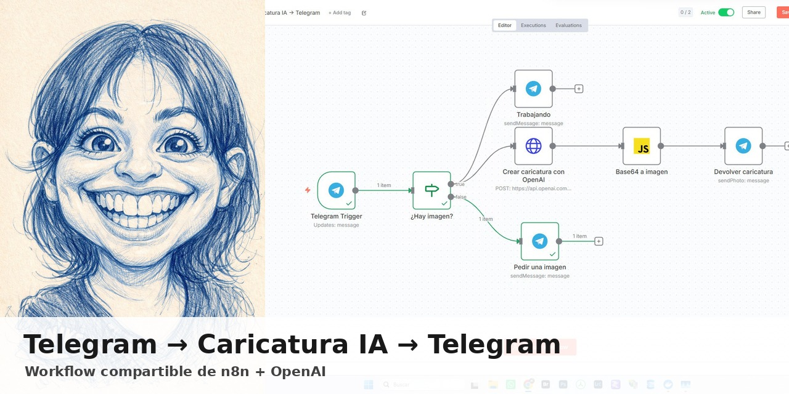
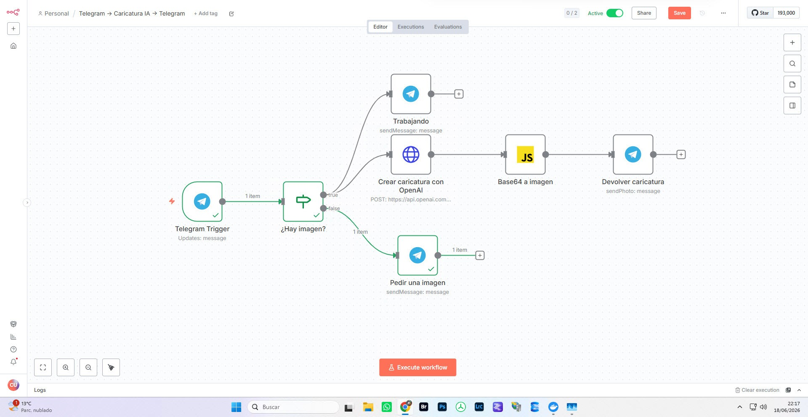

# Telegram → Caricatura IA → Telegram



Workflow de **n8n** que recibe una fotografía desde un bot de Telegram, genera una caricatura en estilo lápiz azul mediante la API de OpenAI y devuelve el resultado al mismo chat.

La idea es sencilla: cualquier persona puede crear desde el móvil una caricatura divertida de una fotografía, sin instalar aplicaciones adicionales y sin manejar directamente herramientas de generación de imágenes.

## Demostración

| Workflow en n8n | Resultado |
|---|---|
|  |  |

## Qué hace el workflow

```text
Telegram Trigger
       │
       ▼
¿Hay una imagen?
   ├── No  → Pedir una imagen
   └── Sí  → Avisar «Trabajando...»
                  │
                  ▼
        OpenAI Images Edits API
                  │
                  ▼
          Convertir Base64 a PNG
                  │
                  ▼
        Enviar caricatura a Telegram
```

El archivo compartido mantiene la estructura del workflow original. Únicamente se han sustituido las credenciales por marcadores genéricos.

## Requisitos

- Una instancia de n8n.
- Un bot de Telegram creado mediante `@BotFather`.
- Una clave de la API de OpenAI con facturación habilitada.
- Una URL pública HTTPS para los webhooks de Telegram.
- Acceso al modelo `gpt-image-1.5`.

## Instalación rápida

### 1. Descargar el proyecto

Descarga este repositorio o clónalo:

```bash
git clone https://github.com/TU_USUARIO/telegram-caricatura-ia-n8n.git
cd telegram-caricatura-ia-n8n
```

### 2. Crear el bot de Telegram

1. Abre Telegram.
2. Busca `@BotFather`.
3. Ejecuta `/newbot`.
4. Indica el nombre y el nombre de usuario del bot.
5. Guarda el token en un lugar seguro.

No publiques el token en GitHub, capturas, logs o documentación.

### 3. Crear la clave de OpenAI

Crea una clave de API dentro de tu proyecto de OpenAI y guárdala de forma segura.

El workflow utiliza:

```text
POST https://api.openai.com/v1/images/edits
```

Configuración incluida:

| Parámetro | Valor |
|---|---|
| Modelo | `gpt-image-1.5` |
| Tamaño | `1024x1536` |
| Calidad | `medium` |
| Formato | `png` |
| Tiempo máximo | `300000 ms` |

### 4. Importar el workflow en n8n

Importa el archivo:

```text
workflow/Telegram_Caricatura_IA_sin_credenciales.json
```

En n8n:

1. Abre **Workflows**.
2. Selecciona **Import from File**.
3. Elige el JSON del directorio `workflow`.
4. Guarda el workflow.

### 5. Configurar Telegram en n8n

Crea una credencial nueva de Telegram con el token obtenido en `@BotFather`.

Después selecciona esa misma credencial en estos nodos:

- `Telegram Trigger`
- `Trabajando`
- `Pedir una imagen`
- `Devolver caricatura`

Los valores incluidos en el JSON son marcadores y no son credenciales reales:

```text
YOUR_TELEGRAM_CREDENTIAL_ID
YOUR_TELEGRAM_CREDENTIAL_NAME
```

### 6. Configurar OpenAI

Abre el nodo:

```text
Crear caricatura con OpenAI
```

En el encabezado `Authorization`, sustituye:

```text
Bearer YOUR_OPENAI_API_KEY
```

por tu clave real:

```text
Bearer sk-...
```

Hazlo únicamente dentro de tu instancia privada de n8n. No vuelvas a exportar y publicar el workflow con esa clave.

Para una instalación más segura, puedes sustituir posteriormente el encabezado escrito directamente por una credencial de tipo **Header Auth** gestionada por n8n.

### 7. Configurar el webhook

Telegram necesita alcanzar tu instancia de n8n mediante una dirección pública HTTPS.

En instalaciones detrás de un proxy inverso, configura correctamente:

```text
WEBHOOK_URL=https://n8n.tudominio.com/
N8N_PROXY_HOPS=1
```

No utilices `localhost` como webhook de producción.

### 8. Activar y probar

1. Guarda el workflow.
2. Actívalo.
3. Abre el bot en Telegram.
4. Envía una fotografía como imagen.
5. El bot enviará `Trabajando...`.
6. Tras procesarla, devolverá la caricatura en PNG.

## Prompt incluido

El prompt exacto está documentado en [`docs/PROMPT.md`](docs/PROMPT.md). También permanece integrado dentro del JSON del workflow.

## Seguridad

- Nunca publiques claves, tokens o exportaciones de credenciales.
- Revisa los archivos antes de cada `git push`.
- Revoca inmediatamente cualquier clave expuesta.
- Evita incluir capturas del navegador donde aparezcan tokens o URL privadas.
- Los JSON exportados por n8n pueden contener nombres e identificadores de credenciales, aunque no incluyan necesariamente el secreto.
- Consulta [`SECURITY.md`](SECURITY.md).

## Privacidad y uso responsable

Las fotografías pasan por Telegram, tu instancia de n8n y la API de OpenAI. Informa a las personas usuarias y obtén permiso para procesar fotografías de terceros.

La instancia de n8n puede conservar datos y archivos binarios dentro del historial de ejecuciones según su configuración. Para un bot público, revisa el almacenamiento de ejecuciones, el borrado automático y la política de privacidad de tu servicio.

No presentes el resultado como una fotografía real ni lo utilices para suplantar, acosar o perjudicar a otras personas.

## Costes

La API de OpenAI tiene coste por uso. El importe depende del modelo, la calidad, el tamaño y la tarifa vigente. Define límites de gasto y supervisa el consumo antes de ofrecer el bot públicamente.

## Problemas frecuentes

### `Bad request: bad webhook: An HTTPS URL must be provided`

La URL configurada para el webhook no es pública o no usa HTTPS. Revisa `WEBHOOK_URL`, el certificado y el proxy inverso.

### El bot funciona en pruebas, pero no en producción

Telegram admite un único webhook activo por bot. Al alternar entre prueba y producción, una URL puede reemplazar a la otra. Usa bots distintos para pruebas y producción.

### Error `401` de OpenAI

La clave es incorrecta, ha sido revocada o no está escrita como:

```text
Bearer TU_CLAVE
```

### No se recibe una imagen

Envía la fotografía como imagen desde Telegram y comprueba que el nodo `Telegram Trigger` tiene activada la descarga de imágenes o archivos.

### No existe `data[0].b64_json`

La petición de OpenAI ha fallado o la respuesta no contiene la imagen esperada. Revisa la ejecución del nodo HTTP y el mensaje de error devuelto por la API.

## Estructura del repositorio

```text
telegram-caricatura-ia-n8n/
├── .github/
│   └── ISSUE_TEMPLATE/
├── assets/
│   ├── portada-github.jpg
│   ├── resultado-caricatura.jpg
│   └── workflow-n8n.jpg
├── docs/
│   ├── CONFIGURACION.md
│   ├── PRIVACIDAD.md
│   ├── PROMPT.md
│   └── PUBLICAR_EN_GITHUB.md
├── workflow/
│   └── Telegram_Caricatura_IA_sin_credenciales.json
├── .gitignore
├── ASSETS.md
├── CHANGELOG.md
├── CONTRIBUTING.md
├── LICENSE
├── README.md
└── SECURITY.md
```

## Licencia

El workflow y la documentación se publican bajo licencia MIT. Consulta [`LICENSE`](LICENSE).

Las imágenes de demostración se incluyen únicamente para documentar el funcionamiento del proyecto. Consulta [`ASSETS.md`](ASSETS.md).

## Autor

**José Alfonso Benito Guerras — MCD3**
